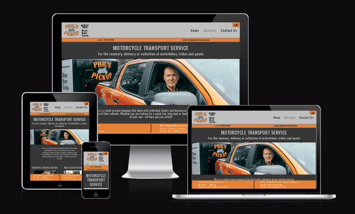

# Phil's Pickup - Motorcycle Transport Service

## # Table of contents:

1. [Link To Live Site](#link-to-live-site)
3. [Wireframes](#wireframes)
4. [Overview](#overview)
6. [Features](#features)
    1. [Index Page](#index-page)
7. [Features to Implement](#features-to-implement)
8. [Testing](#testing)
9. [Unfixed Bugs](#unfixed-bugs)
10. [Deployment](#deployment)
    1. [Forking and Cloning](#forking-and-cloning)
    2. [Local Deployment](#local-deployment)
    3. [Remote Deployment](#remote-deployment)
12. [Marketing Research](#marketing-research)
    1. [Facebook Business Page](#facebook-business-page)
13. [Credits](#credits)

## Link to Live Site

- https://www.phils-pickup.uk

## Wireframes

## Overview

## Features

## Testing

### HTML Validation

### CSS Validation

### JShint Validation

### PEP8 Validation

### Manual Testing

### Automated Testing

## Bugs

## Deployment

To deploy Phil's Pickup, allow other people to run the app, and see it working, there are 3 methods to allow you to complete these actions:

### Forking and Cloning

### Local Deployment

### Remote Deployment

### Facebook Business Page

This site has been linked to the Facebook business page for Phil's Pickup.

There is also a link to my own personal sites; LinkedIn and Github

## Credits

- picresize.com was used for resizing and altering pictures
- compressor.io was used to reduce the file size of images
- Jack Munsch Photography for supplying the majority of the images used in the site